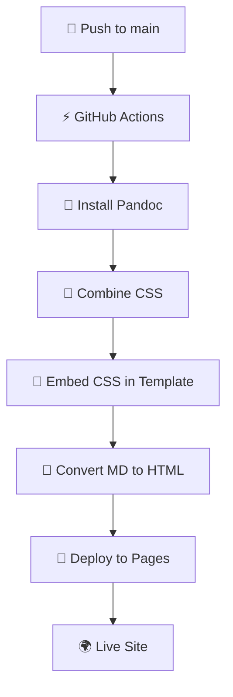

# Markdown to HTML Publisher with CSS Integration

このプロジェクトは、MarkdownファイルをHTMLに変換し、複数のCSSファイルを統合してGitHub Pagesで自動パブリッシュするシステムです。

## ✨ 新機能: CSS統合システム

CSSが適用されない問題を解決するため、以下の機能を実装しました：

- 🎨 **複数CSSファイル自動結合**
- 📄 **HTMLへのCSS直接埋め込み**
- 🚀 **ゼロ外部依存デプロイ**
- 📱 **完全レスポンシブ対応**

## 📁 ディレクトリ構造

```
20250804_test/
├── .github/
│   └── workflows/
│       └── publish.yml          # GitHub Actions ワークフロー
├── markdown/                    # Markdownファイル（コンテンツ）
│   ├── index.md
│   ├── about.md
│   └── contact.md
├── templates/                   # HTMLテンプレート
│   ├── page-template.html       # 外部CSS用（非推奨）
│   └── page-template-inline.html # CSS埋め込み用（推奨）
├── css/                        # CSSスタイル（Spectrum CSS）
│   ├── tokens/                 # デザイントークン
│   ├── typography/             # タイポグラフィ
│   ├── button/                 # ボタンコンポーネント
│   ├── icon/                   # アイコンコンポーネント
│   └── page/                   # ページレイアウト
├── scripts/                    # ビルドスクリプト
│   ├── build.sh               # メインビルドスクリプト
│   ├── serve.sh               # ローカルサーバー
│   ├── combine-css.sh         # CSS結合スクリプト
│   └── embed-css.py           # CSS埋め込みスクリプト
├── docs/                       # ドキュメント
│   ├── github-pages-setup.md  # GitHub Pages設定ガイド
│   └── css-integration.md     # CSS統合システム詳細
├── output/                     # 生成されたHTMLファイル
└── package.json               # プロジェクト設定
```

## 🚀 使用方法

### 前提条件

以下がインストールされている必要があります：

- **Node.js** (v18以上)
- **Python 3** (システム標準)
- **Pandoc** (MarkdownをHTMLに変換)

#### Pandocのインストール

```bash
# macOS
brew install pandoc

# Ubuntu/Debian
sudo apt-get install pandoc

# Windows
# https://pandoc.org/installing.html からダウンロード
```

### ローカル開発

1. **フルビルド実行**
   ```bash
   npm run build
   ```

2. **ローカルサーバー起動**
   ```bash
   npm run serve
   ```

3. **開発モード（ビルド + サーバー起動）**
   ```bash
   npm run dev
   ```

4. **ビルドテスト**
   ```bash
   npm run test:build
   ```

5. **クリーンアップ**
   ```bash
   npm run clean
   ```

### CSS関連の個別操作

```bash
# CSS結合のみ
npm run css:combine

# CSS埋め込みのみ（結合後）
npm run css:embed
```

## 🔧 CSS統合システム

### 動作原理

1. **CSS結合**: 複数のCSSファイルを依存関係順で結合
2. **テンプレート生成**: 結合CSSをHTMLテンプレートに埋め込み
3. **HTML生成**: Pandocで最終HTMLを生成
4. **デプロイ**: 自己完結型HTMLをGitHub Pagesに配置

### 対象CSSファイル（読み込み順）

1. `css/tokens/custom/global-vars.css` - グローバル変数
2. `css/tokens/custom/light-vars.css` - ライトテーマ
3. `css/tokens/custom/medium-vars.css` - ミディアムサイズ
4. `css/typography/index.css` - タイポグラフィ
5. `css/page/index.css` - ページレイアウト
6. `css/button/index.css` - ボタンコンポーネント
7. `css/icon/index.css` - アイコンコンポーネント

追加で以下のテーマファイルも含まれます：
- `css/page/themes/spectrum-two.css`
- `css/button/themes/spectrum-two.css`
- `css/icon/icons.css`
- `css/icon/workflow-icons.css`
- `css/icon/ui-icons.css`

## 🌐 GitHub Pages での自動デプロイ

### 設定手順

1. **GitHub Pages の有効化**
   - GitHubリポジトリの Settings > Pages
   - Source を "GitHub Actions" に設定

2. **ワークフロー権限の設定**
   - Settings > Actions > General
   - "Read and write permissions" を有効化

3. **コンテンツの更新とデプロイ**
   ```bash
   # Markdownファイルを編集
   git add .
   git commit -m "Update content"
   git push origin main
   ```

### デプロイフロー



## 📝 Markdownファイルの書き方

Frontmatterでメタデータを設定できます：

```markdown
---
title: ページタイトル
date: 2025-08-04
---

# コンテンツ

ここにMarkdownコンテンツを書きます。

## 見出し2

- リスト項目1
- リスト項目2

### 見出し3

**太字**や*斜体*、`コード`も使用できます。

```code
コードブロックもサポート
```

> 引用文も美しく表示されます

[リンク](https://example.com)も正常に動作します。
```

### 利用可能なFrontmatterフィールド

- `title`: ページタイトル（HTMLの`<title>`タグとh1見出しに使用）
- `date`: 公開日（ページ上に表示）

## 🎨 デザインシステム

このプロジェクトは **Adobe Spectrum CSS** デザインシステムを使用：

- 🎯 **一貫性**: 統一されたデザイン言語
- 📱 **レスポンシブ**: モバイルファーストデザイン
- 🌙 **テーマ**: ライト・ダークテーマ対応
- ♿ **アクセシビリティ**: WAI-ARIA準拠
- 🚀 **パフォーマンス**: 最適化されたCSS

## 🔧 トラブルシューティング

### よくある問題

#### 1. Pandocが見つからない
```
Error: pandoc is not installed
```
**解決**: Pandocをインストールしてください

#### 2. Python3が見つからない
```
python3: command not found
```
**解決**: Python 3をインストールしてください

#### 3. CSSが適用されない
- ローカルビルドでHTMLファイルを確認
- ブラウザ開発者ツールで`<style>`タグの内容を確認
- `docs/css-integration.md`のデバッグガイドを参照

#### 4. GitHub Actions が失敗する
- Actions タブでエラーログを確認
- ワークフロー権限が正しく設定されているか確認
- `docs/github-pages-setup.md`のトラブルシューティングを参照

### デバッグコマンド

```bash
# CSSファイル結合テスト
./scripts/combine-css.sh
ls -la temp/

# HTML生成テスト
npm run test:build
open output/index.html

# ローカルサーバーでテスト
npm run dev
# → http://localhost:8000 で確認
```

## 📊 パフォーマンス特性

### ✅ 利点

- **ゼロ外部リクエスト**: CSS全埋め込み済み
- **高速初期表示**: CSSブロッキングなし
- **オフライン対応**: 外部依存なし
- **CDN効率**: HTMLファイルのみキャッシュ

### ⚠️ 注意点

- **ファイルサイズ**: HTMLファイルが大きくなる（約50-100KB増加）
- **キャッシュ効率**: CSS変更時にHTMLも再取得
- **デバッグ**: 結合後CSSの追跡が困難

## 🚀 本番環境推奨設定

```bash
# 本番デプロイ前のテスト
npm run test:build

# 生成されたHTMLの確認
ls -la output/
du -h output/*.html

# ローカルでの最終確認
npm run serve
```

## 📚 詳細ドキュメント

- **GitHub Pages設定**: [`docs/github-pages-setup.md`](docs/github-pages-setup.md)
- **CSS統合システム**: [`docs/css-integration.md`](docs/css-integration.md)
- **Spectrum CSS ドキュメント**: 各 `css/*/README.md`

## 🌟 機能一覧

- ✅ MarkdownからHTMLへの自動変換
- ✅ 複数CSSファイルの自動結合・埋め込み
- ✅ Spectrum CSS デザインシステム統合
- ✅ GitHub Actions による自動デプロイ
- ✅ ローカル開発環境
- ✅ レスポンシブデザイン
- ✅ Frontmatter サポート
- ✅ 日本語完全対応
- ✅ ゼロ外部依存
- ✅ SEO最適化

## 📄 ライセンス

MIT License

---

**重要**: このバージョンでは、CSSファイルがHTMLに直接埋め込まれるため、GitHub Pagesでの確実なスタイル適用が保証されます。