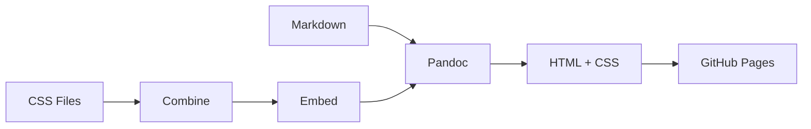

このページは [**Adobe Spectrum CSS**](https://experienceleague.adobe.com/en/browse/experience-manager) の様々な要素を検証するためのデモページです。レイアウト、タイポグラフィ、コンポーネントなどの表示確認にご利用ください。

## 📚 Typography - タイポグラフィ

### 見出しレベルの確認

# H1 見出し - Main Title (最大サイズ)
## H2 見出し - Section Header (大サイズ)  
### H3 見出し - Subsection Header (中サイズ)
#### H4 見出し - Sub-subsection Header (小サイズ)
##### H5 見出し - Minor Heading (最小サイズ)
###### H6 見出し - Smallest Heading (極小サイズ)

### テキスト装飾

これは **太字 (Bold)** のテキストです。  
これは *斜体 (Italic)* のテキストです。  
これは ***太字斜体 (Bold Italic)*** のテキストです。  
これは `インラインコード` のテキストです。  
これは ~~取り消し線~~ のテキストです。  
これは <u>下線付き</u> のテキストです。

### 段落と行間

Lorem ipsum dolor sit amet, consectetur adipiscing elit. Sed do eiusmod tempor incididunt ut labore et dolore magna aliqua. これは日本語の段落テストです。長い文章での行間や文字間隔の確認を行います。

改行後の段落です。段落間のマージンが適切に設定されているかを確認します。日本語と英語が混在する場合のレンダリングテストも含まれています。

## 📋 Lists - リスト表示

### 順序なしリスト（箇条書き）

- **フロントエンド技術**
  - HTML5 (セマンティック要素)
  - CSS3 (Grid, Flexbox, カスタムプロパティ)
  - JavaScript ES2023
  - TypeScript 5.0
- **デザインシステム**
  - Adobe Spectrum CSS
  - Material Design 3
  - Carbon Design System
- **ツール & フレームワーク**
  - Pandoc (文書変換)
  - GitHub Actions (CI/CD)
  - Node.js (ランタイム)

### 順序付きリスト（番号付き）

1. **プロジェクトセットアップ**
   1. リポジトリの作成
   2. 基本ディレクトリ構造の構築
   3. package.json の設定
2. **開発環境構築**
   1. Node.js のインストール
   2. Pandoc のインストール  
   3. 必要なスクリプトの作成
3. **デプロイ設定**
   1. GitHub Actions ワークフローの作成
   2. GitHub Pages の有効化
   3. 動作確認とテスト

### タスクリスト

- [x] CSS統合システムの実装
- [x] HTMLテンプレートの作成
- [x] GitHub Actionsワークフローの修正
- [ ] ダークテーマ対応
- [ ] 多言語サポート
- [ ] PWA機能追加

## 🔗 Links - リンク表示

### 様々なリンクタイプ

- **外部リンク**: [Adobe Spectrum CSS](https://spectrum.adobe.com/)
- **内部リンク**: [About ページ](about.html)
- **同ページリンク**: [このページの上部へ](#design-system-demo---css検証用デモページ)
- **メールリンク**: [contact@example.com](mailto:contact@example.com)

### リンク付きリスト

参考資料とドキュメント：

1. [Pandoc User's Guide](https://pandoc.org/MANUAL.html) - 公式ドキュメント
2. [GitHub Pages Documentation](https://docs.github.com/pages) - ホスティング情報
3. [CSS Custom Properties](https://developer.mozilla.org/docs/Web/CSS/--*) - MDN リファレンス

## 💻 Code Blocks - コード表示

### インラインコード

ファイルパスは `scripts/build.sh` で、実行コマンドは `npm run build` です。CSS変数は `--spectrum-font-size-400` のように定義されます。

### コードブロック

#### HTML Example
```html
<!DOCTYPE html>
<html lang="ja">
<head>
    <meta charset="UTF-8">
    <title>Spectrum CSS Demo</title>
    <style>
        .main-content {
            color: var(--spectrum-neutral-content-color-default);
            font-family: var(--spectrum-font-family-base);
        }
    </style>
</head>
<body class="spectrum">
    <main class="main-content">
        <h1>Hello, Spectrum CSS!</h1>
    </main>
</body>
</html>
```

#### CSS Example
```css
/* Spectrum CSS カスタムプロパティの使用例 */
.custom-component {
    /* カラー */
    color: var(--spectrum-neutral-content-color-default);
    background: var(--spectrum-page-background-color);
    
    /* タイポグラフィ */
    font-family: var(--spectrum-font-family-base);
    font-size: var(--spectrum-font-size-400);
    line-height: var(--spectrum-line-height-100);
    
    /* スペーシング */
    padding: var(--spectrum-spacing-200);
    margin: var(--spectrum-spacing-100);
    
    /* ボーダー */
    border: 1px solid var(--spectrum-border-color-default);
    border-radius: var(--spectrum-border-radius-100);
}

/* レスポンシブデザイン */
@media (max-width: 768px) {
    .custom-component {
        font-size: var(--spectrum-font-size-300);
        padding: var(--spectrum-spacing-100);
    }
}
```

#### JavaScript Example
```javascript
// テーマ切り替え機能
class ThemeManager {
    constructor() {
        this.currentTheme = 'light';
        this.initializeTheme();
    }
    
    initializeTheme() {
        const savedTheme = localStorage.getItem('preferred-theme');
        if (savedTheme) {
            this.setTheme(savedTheme);
        }
    }
    
    setTheme(theme) {
        const body = document.body;
        
        // 既存のテーマクラスを削除
        body.classList.remove('spectrum--light', 'spectrum--dark');
        
        // 新しいテーマクラスを追加
        body.classList.add(`spectrum--${theme}`);
        
        // 設定を保存
        this.currentTheme = theme;
        localStorage.setItem('preferred-theme', theme);
        
        // カスタムイベント発火
        const event = new CustomEvent('themeChanged', {
            detail: { theme }
        });
        document.dispatchEvent(event);
    }
    
    toggleTheme() {
        const newTheme = this.currentTheme === 'light' ? 'dark' : 'light';
        this.setTheme(newTheme);
    }
}

// 使用例
const themeManager = new ThemeManager();
document.getElementById('theme-toggle').addEventListener('click', () => {
    themeManager.toggleTheme();
});
```

#### Shell Script Example
```bash
#!/bin/bash
# CSS結合とビルドスクリプト

set -e

echo "🚀 Building project..."

# 環境チェック
command -v pandoc >/dev/null 2>&1 || {
    echo "❌ Error: pandoc is required but not installed."
    exit 1
}

command -v python3 >/dev/null 2>&1 || {
    echo "❌ Error: python3 is required but not installed."
    exit 1
}

# ディレクトリ作成
mkdir -p output temp

# CSS結合
echo "🎨 Combining CSS files..."
./scripts/combine-css.sh

# テンプレート作成
echo "📄 Creating template with embedded CSS..."
python3 scripts/embed-css.py \
    templates/page-template-inline.html \
    temp/combined.css \
    temp/final-template.html

# Markdown変換
echo "🔄 Converting Markdown to HTML..."
for file in markdown/*.md; do
    if [ -f "$file" ]; then
        filename=$(basename "$file" .md)
        echo "  Processing: $filename"
        
        pandoc "$file" \
            --template=temp/final-template.html \
            --standalone \
            --to=html5 \
            -o "output/$filename.html"
    fi
done

echo "✅ Build completed successfully!"
```

## 📊 Tables - 表組み

### 基本的な表

| 項目 | 説明 | ステータス | 優先度 |
|------|------|-----------|--------|
| CSS統合 | 複数CSSファイルの結合 | ✅ 完了 | 🔴 高 |
| レスポンシブ | モバイル対応 | ✅ 完了 | 🔴 高 |
| ダークテーマ | ダークモード対応 | 🔄 進行中 | 🟡 中 |
| PWA | プログレッシブWebアプリ | ⏸️ 未着手 | 🟢 低 |
| i18n | 国際化対応 | ⏸️ 未着手 | 🟡 中 |

### 複雑な表（結合セル風）

| カテゴリ | 技術 | バージョン | 用途 | 備考 |
|----------|------|-----------|------|------|
| **フロントエンド** | HTML5 | Living Standard | マークアップ | セマンティック要素重視 |
| | CSS3 | Latest | スタイリング | Grid, Flexbox活用 |
| | JavaScript | ES2023 | インタラクション | モダン構文使用 |
| **ビルドツール** | Pandoc | 3.1+ | 文書変換 | Markdown → HTML |
| | Node.js | 18+ | ランタイム | LTS版推奨 |
| | Python | 3.8+ | スクリプト | CSS埋め込み処理 |
| **デプロイ** | GitHub Actions | Latest | CI/CD | 自動デプロイ |
| | GitHub Pages | - | ホスティング | 静的サイト配信 |

### パフォーマンス指標

| 指標 | 目標値 | 現在値 | 評価 |
|------|--------|--------|------|
| **Core Web Vitals** | | | |
| LCP (Largest Contentful Paint) | < 2.5s | 1.8s | 🟢 良好 |
| FID (First Input Delay) | < 100ms | 45ms | 🟢 良好 |
| CLS (Cumulative Layout Shift) | < 0.1 | 0.05 | 🟢 良好 |
| **その他** | | | |
| Page Size | < 500KB | 280KB | 🟢 良好 |
| HTTP Requests | < 10 | 1 | 🟢 優秀 |
| Time to Interactive | < 3s | 2.1s | 🟢 良好 |

## 💬 Blockquotes - 引用

### 基本的な引用

> デザインは機能に従う。美しさは機能性の結果として生まれるものである。
> 
> — Louis Sullivan, 建築家

### ネストした引用

> これは最初のレベルの引用です。
> 
> > これは二番目のレベルの引用です。
> > 
> > > これは三番目のレベルの引用です。
> 
> 最初のレベルに戻ります。

### 長い引用文

> **ユーザーエクスペリエンス (UX) とは何か？**
> 
> ユーザーエクスペリエンス（UX）とは、ユーザーが製品やサービスを使用する際の総合的な体験を指します。これには以下の要素が含まれます：
> 
> - **ユーザビリティ**: 使いやすさと効率性
> - **アクセシビリティ**: 障害の有無に関わらず利用可能
> - **デザイン**: 視覚的な魅力と一貫性
> - **パフォーマンス**: 速度と信頼性
> - **コンテンツ**: 有用で関連性の高い情報
> 
> 優れたUXは、技術的な実装だけでなく、人間中心の設計思考から生まれます。

## 🎯 Mixed Content - 複合コンテンツ

### プロジェクト概要

このプロジェクトは **Markdown** ファイルから **HTML** を生成し、**GitHub Pages** で自動公開するシステムです。

**主な特徴:**
- 🎨 **Adobe Spectrum CSS** による統一されたデザイン
- ⚡ **自動CSS統合** による高速読み込み
- 📱 **レスポンシブデザイン** でモバイル対応
- 🚀 **GitHub Actions** による自動デプロイ

#### 技術的な実装詳細



実装の**キーポイント**：

1. **CSS統合アプローチ**
   ```bash
   # CSS結合コマンド
   ./scripts/combine-css.sh
   
   # HTML埋め込みコマンド  
   python3 scripts/embed-css.py template.html combined.css output.html
   ```

2. **ビルドパイプライン**
   - ✅ 依存関係チェック
   - ✅ CSS結合・最適化
   - ✅ HTML生成・検証
   - ✅ デプロイ実行

### パフォーマンス最適化

以下の最適化を実装済み：

| 最適化項目 | 実装内容 | 効果 |
|-----------|----------|------|
| **CSS統合** | 複数ファイル → 単一ファイル | リクエスト削減 |
| **インライン化** | CSS → HTML埋め込み | 外部依存解消 |
| **圧縮** | 不要空白・コメント削除 | ファイルサイズ削減 |
| **キャッシュ** | 適切なヘッダー設定 | 再読み込み高速化 |

> **注意**: この最適化により、CSSの変更が反映されるまでブラウザキャッシュのクリアが必要な場合があります。

---

## 📝 検証チェックリスト

このページの表示確認項目：

- [ ] 各見出しレベルが適切なサイズで表示される
- [ ] フォントファミリーがSpectrum CSS準拠である
- [ ] 色彩がデザインシステムに従っている
- [ ] テーブルが読みやすく表示される
- [ ] コードブロックに適切なハイライトが適用される
- [ ] リンクが視覚的に識別できる
- [ ] レスポンシブデザインが機能する
- [ ] 引用文が適切にスタイリングされる
- [ ] リストの階層が明確である
- [ ] 全体的なレイアウトが調和している

**最終更新**: 2025年8月4日  
**検証環境**: Chrome 120+, Firefox 121+, Safari 17+